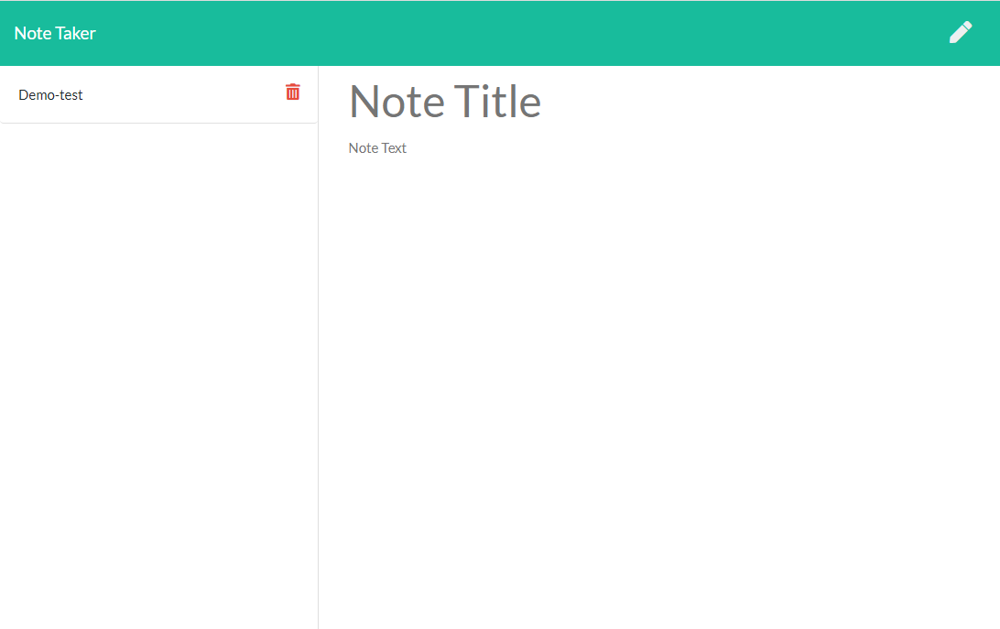
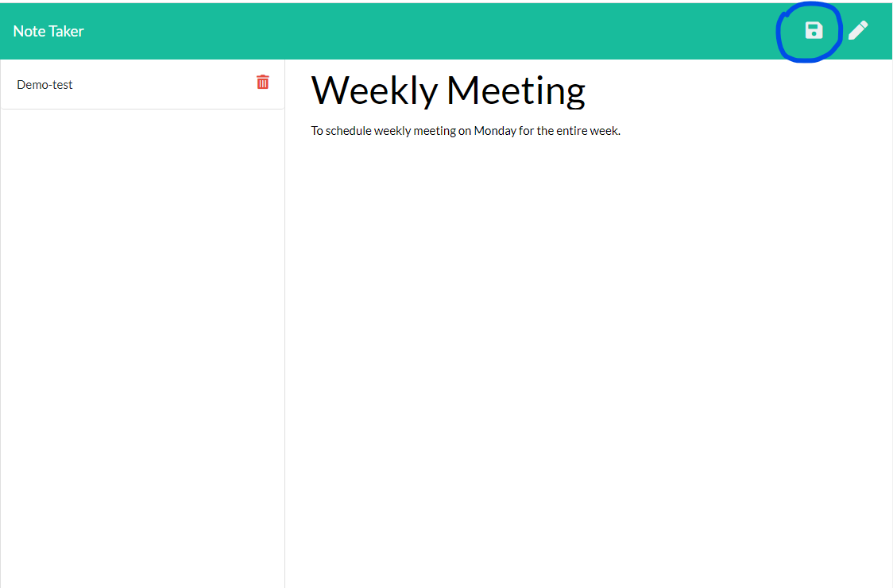
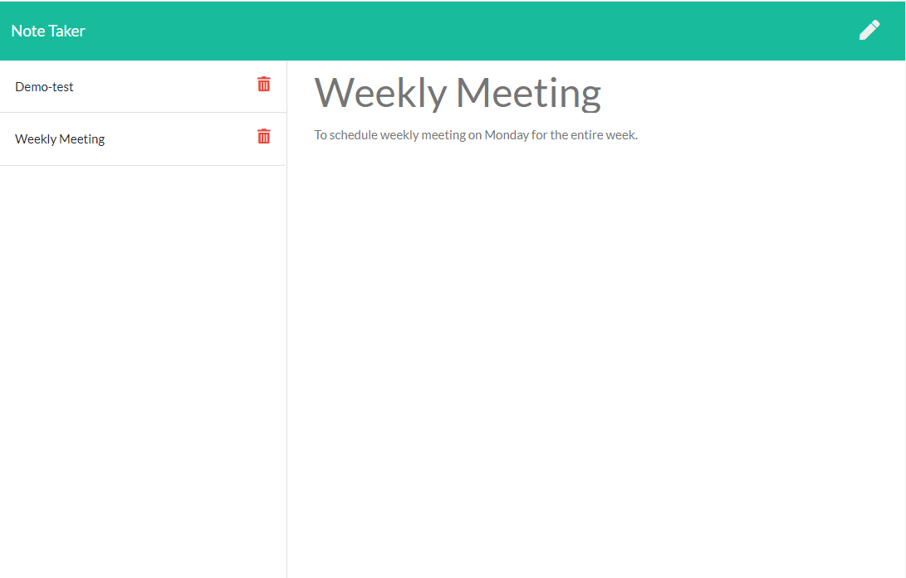

# Note Taker

## Table of Contents
* [Project description](#description)
* [How to install the app](#installation)
* [How to use the app](#usage)
* [License](#license)

# Project description
This project is to build an application using node and express.js for user to write, save and delete notes.
# How to install the app

* No installation required, user clicks the link to the deployed [web URL](https://note-taker-kge.herokuapp.com/) and the app is ready for use.

# How to use the app

* After opening the [Note Taker webpage](https://note-taker-kge.herokuapp.com/), a landing page will be presented.

* Click "Get Started" button to proceed to the note recording screen.

* User can click the "Note Title" to begin enter the title of the note, and click the "Note Text" area to write the details of the notes. Once both fields are completed, click the "save" Icon on the top-right corner.

Please Note: the save icon will only appear when there are contents in both title and details fields!

* The saved note will appear on the left penal with a "delete" option if user choose to delete it.

# License
MIT